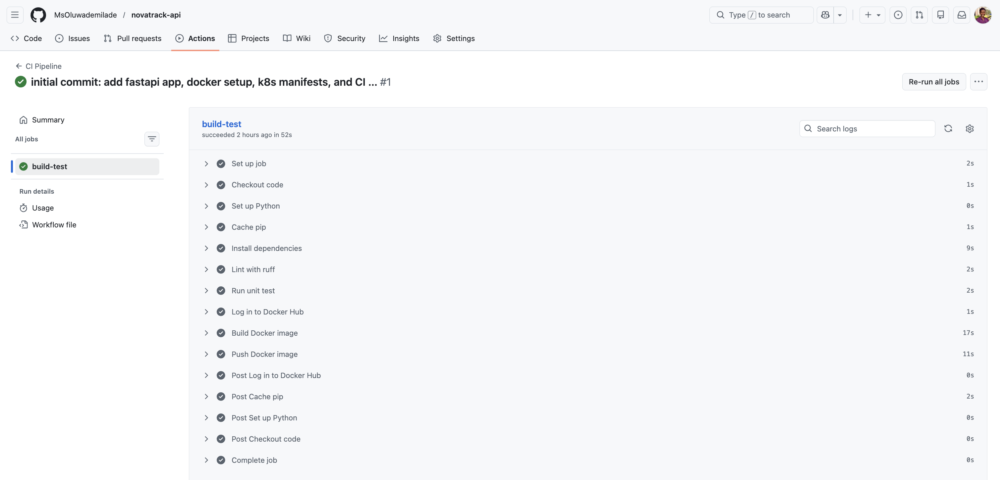
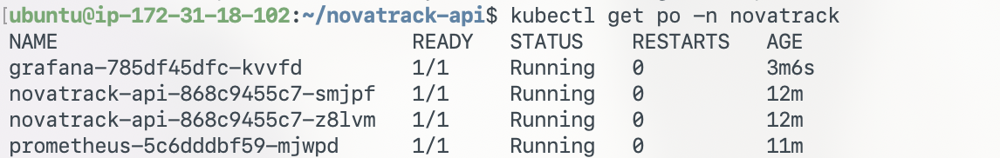
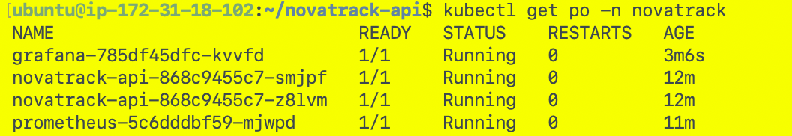
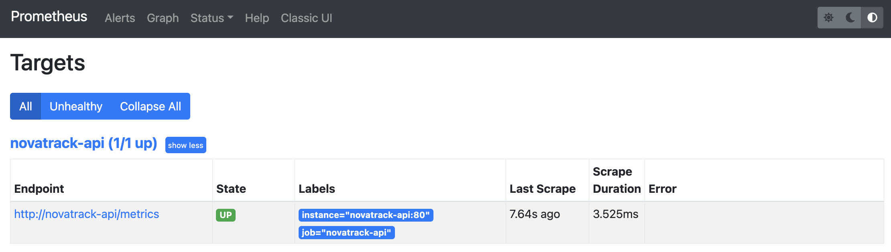
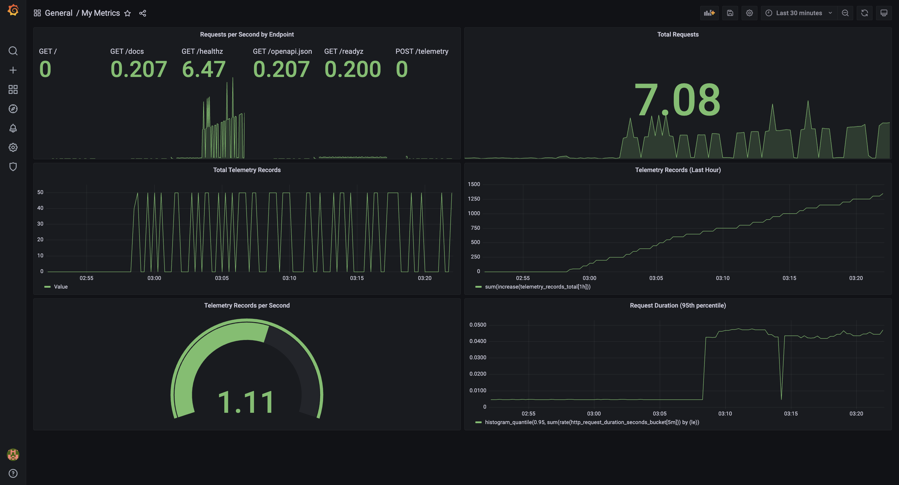
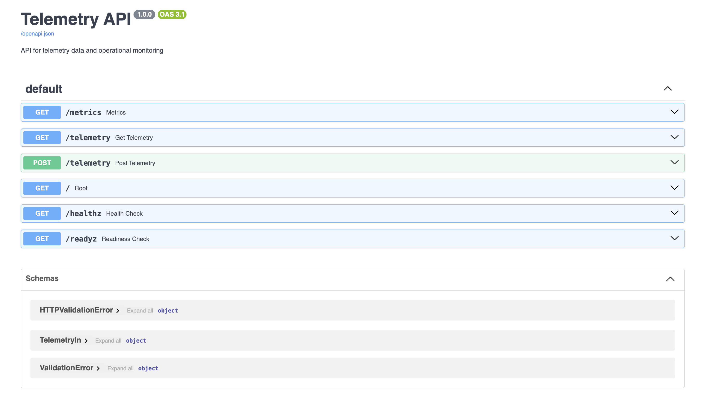
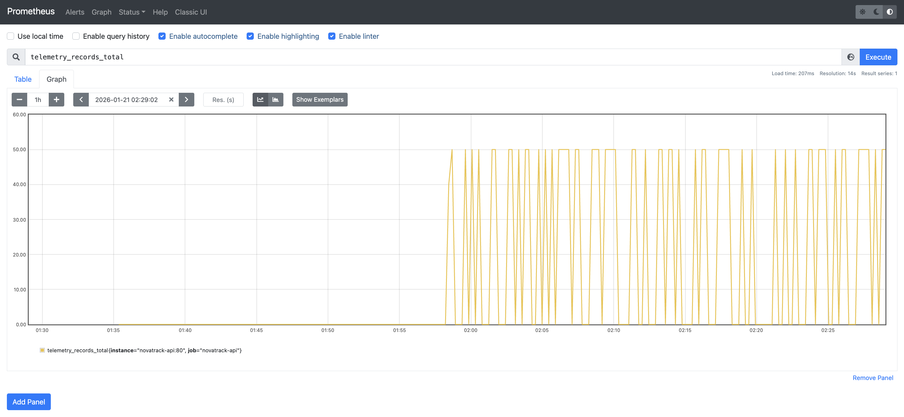

# NovaTrack API

A production-grade telemetry API service built with FastAPI, demonstrating modern DevOps practices including containerization, CI/CD, Kubernetes orchestration, and  observability.

## Table of Contents

- [Overview](#overview)
- [Technology Stack](#technology-stack)
- [Project Structure](#project-structure)
- [Local Development](#local-development)
- [Testing](#testing)
- [CI/CD Pipeline](#cicd-pipeline)
- [Kubernetes Deployment](#kubernetes-deployment)
- [Observability & Monitoring](#observability--monitoring)
- [API Documentation](#api-documentation)
- [Operational Considerations](#operational-considerations)

## Overview

NovaTrack is an internal API service designed to expose operational telemetry data (sensor readings, environmental metrics) to downstream dashboards and analytics tools. While the application logic is intentionally minimal, the service implements production-grade DevOps practices including:

- **Containerization** with Docker using multi-stage builds and security best practices
- **Local orchestration** using Docker Compose for development environments
- **Automated CI/CD** with GitHub Actions for testing, building, and deployment
- **Kubernetes deployment** with Kind for local cluster management
- **Comprehensive observability** using Prometheus for metrics collection and Grafana for visualization
- **Production-ready configuration** with health checks, resource limits, and horizontal pod autoscaling

## Technology Stack

- **Application Framework**: FastAPI (Python 3.12)
- **ASGI Server**: Uvicorn
- **Containerization**: Docker, Docker Compose
- **Orchestration**: Kubernetes (Kind)
- **CI/CD**: GitHub Actions
- **Metrics & Monitoring**: Prometheus, Grafana
- **Testing**: pytest, httpx
- **Linting**: ruff
- **Instrumentation**: prometheus-client

## Project Structure

```
novatrack-api/
├── README.md
├── requirements.txt
├── Dockerfile
├── .dockerignore
├── docker-compose.yml
├── app/
│   ├── main.py                    # FastAPI application entry point
│   ├── api/
│   │   ├── __init__.py
│   │   └── telemetry.py          # Telemetry endpoints
│   ├── core/
│   │   ├── __init__.py
│   │   ├── config.py             # Application configuration
│   │   ├── logging.py            # Structured logging setup
│   │   └── metrics.py            # Prometheus metrics & middleware
│   ├── models/
│   │   ├── __init__.py
│   │   └── telemetry.py          # Pydantic models
│   └── tests/
│       ├── __init__.py
│       └── test_health.py        # Health check tests
├── k8s/
│   ├── namespace.yml             # Kubernetes namespace
│   ├── deployment.yml            # Application deployment
│   ├── service.yml               # Service configuration
│   ├── hpa.yml                   # Horizontal Pod Autoscaler
│   ├── kind/
│   │   └── kind-config.yml       # Kind cluster configuration
│   ├── prometheus/
│   │   ├── prometheus-configmap.yml
│   │   ├── prometheus-deployment.yml
│   │   └── prometheus-service.yml
│   └── grafana/
│       ├── grafana-deployment.yml
│       └── grafana-service.yml
└── .github/
    └── workflows/
        └── ci.yml                # CI/CD pipeline
```

## Local Development

### Prerequisites

- Python 3.12+
- Docker & Docker Compose
- kubectl
- Kind (Kubernetes in Docker)

### Quick Start with Docker Compose

1. Clone the repository:
```bash
git clone https://github.com/MsOluwademilade/novatrack-api.git
cd novatrack-api
```

2. Start the application:
```bash
docker-compose up --build
```

3. Access the API:
- API: http://localhost:8000
- API Docs: http://localhost:8000/docs
- Metrics: http://localhost:8000/metrics

### Local Python Development 

1. Create a virtual environment:
```bash
python -m venv venv
source venv/bin/activate  # On Windows: venv\Scripts\activate
```

2. Install dependencies:
```bash
pip install -r requirements.txt
```

3. Run the application:
```bash
uvicorn app.main:app --reload --host 0.0.0.0 --port 8000
```

## Testing

The project includes unit tests for critical endpoints.

### Run Tests Locally

```bash
# Install test dependencies
pip install -r requirements.txt

# Run tests
PYTHONPATH=. pytest app/tests

# Run with coverage
PYTHONPATH=. pytest app/tests --cov=app
```

### Run Linting

```bash
pip install ruff
ruff check app
```

## CI/CD Pipeline

The project uses GitHub Actions for automated testing and deployment. The pipeline is triggered on:
- Push to `main` branch
- Pull requests
- Manual workflow dispatch

### Pipeline Stages

1. **Lint**: Code quality checks using ruff
2. **Test**: Unit tests with pytest
3. **Build**: Docker image creation
4. **Push**: Image push to Docker Hub (on main branch only)



### Configuration

The pipeline requires the following GitHub secrets:
- `DOCKERHUB_USERNAME`: Docker Hub username
- `DOCKERHUB_TOKEN`: Docker Hub access token


## Kubernetes Deployment

### Setup Kind Cluster

1. Install Kind:
```bash
curl -Lo ./kind https://kind.sigs.k8s.io/dl/v0.23.0/kind-linux-amd64
chmod +x kind
sudo mv kind /usr/local/bin/kind
```

2. Install kubectl:
```bash
sudo snap install kubectl --classic
```

3. Create the Kubernetes cluster:
```bash
kind create cluster --name novatrack --config k8s/kind/kind-config.yml
```

### Deploy the Application

1. Create the namespace:
```bash
kubectl apply -f k8s/namespace.yml
```

2. Deploy the application:
```bash
kubectl apply -f k8s/deployment.yml
kubectl apply -f k8s/service.yml
```

3. Verify deployment:
```bash
kubectl get pods -n novatrack
kubectl get svc -n novatrack
```



### Deploy Monitoring Stack

1. Deploy Prometheus:
```bash
kubectl apply -f k8s/prometheus/prometheus-configmap.yml
kubectl apply -f k8s/prometheus/prometheus-deployment.yml
kubectl apply -f k8s/prometheus/prometheus-service.yml
```

2. Deploy Grafana:
```bash
kubectl apply -f k8s/grafana/grafana-deployment.yml
kubectl apply -f k8s/grafana/grafana-service.yml
```

3. Verify monitoring stack:
```bash
kubectl get pods -n novatrack
```

Expected output:
```
NAME                             READY   STATUS    RESTARTS   AGE
grafana-692df45egt-kvvfd         1/1     Running   0          3m
novatrack-api-264c1234c5-smjpf   1/1     Running   0          12m
novatrack-api-264c1234c5-z8lvm   1/1     Running   0          12m
prometheus-2c9eftbn42-mjwpd      1/1     Running   0          11m
```



### Horizontal Pod Autoscaling (Optional)

```bash
kubectl apply -f k8s/hpa.yml
```

## Observability & Monitoring

### Metrics Exposed

The application exposes the following Prometheus metrics via `/metrics`:

- `telemetry_records_total`: Counter tracking total telemetry records received
- `http_request_duration_seconds`: Histogram measuring API response times by method, endpoint, and status
- `active_requests`: Gauge showing currently processing requests

### Accessing Services

#### Option 1: Port Forwarding

```bash
# Access Prometheus
kubectl port-forward -n novatrack svc/prometheus 9090:9090 --address 0.0.0.0

# Access Grafana (in another terminal)
kubectl port-forward -n novatrack svc/grafana 3000:3000 --address 0.0.0.0
```

- Prometheus UI: http://localhost:9090
- Grafana UI: http://localhost:3000



#### Option 2: Persistent Port Forwarding 

For persistent access that survives reboots, create systemd services:

**Prometheus Port Forward Service**

Create `/etc/systemd/system/prometheus-port-forward.service`:

```ini
[Unit]
Description=Prometheus Port Forward
After=network.target

[Service]
Type=simple
User=<your-username>
WorkingDirectory=/home/<your-username>
Environment="KUBECONFIG=/home/<your-username>/.kube/config"
Environment="HOME=/home/<your-username>"
ExecStart=<path-to-kubectl> port-forward -n novatrack svc/prometheus 9090:9090 --address 0.0.0.0
Restart=always
RestartSec=10

[Install]
WantedBy=multi-user.target
```

**Grafana Port Forward Service**

Create `/etc/systemd/system/grafana-port-forward.service`:

```ini
[Unit]
Description=Grafana Port Forward
After=network.target

[Service]
Type=simple
User=<your-username>
WorkingDirectory=/home/<your-username>
Environment="KUBECONFIG=/home/<your-username>/.kube/config"
Environment="HOME=/home/<your-username>"
ExecStart=<path-to-kubectl> port-forward -n novatrack svc/grafana 3000:3000 --address 0.0.0.0
Restart=always
RestartSec=10

[Install]
WantedBy=multi-user.target
```
**Setup instructions:**

```bash
# Find your kubectl path
which kubectl

# Replace <path-to-kubectl> in the service files above with the output
# Replace <your-username> with your actual username
```

**Enable and start services**:

```bash
sudo systemctl daemon-reload
sudo systemctl enable prometheus-port-forward grafana-port-forward
sudo systemctl start prometheus-port-forward grafana-port-forward
sudo systemctl status prometheus-port-forward grafana-port-forward
```

### Grafana Setup

1. Access Grafana at http://localhost:3000
2. Default credentials:
   - Username: `admin`
   - Password: `admin` (you'll be prompted to change this)

3. Add Prometheus data source:
   - URL: `http://prometheus:9090`
   - Access: `Server (default)`

4. Create dashboards to visualize:
   - Request rates by endpoint
   - Request duration percentiles
   - Active requests over time
   - Telemetry ingestion rate



## API Documentation

### Endpoints

#### Health Checks

- **GET /healthz** - Liveness probe
  ```json
  {"status": "ok"}
  ```

- **GET /readyz** - Readiness probe
  ```json
  {"status": "ready"}
  ```



#### Send Test Telemetry Data

Generate test data to verify metrics are incrementing:

```bash
# Send 50 telemetry records with 1 second delay
for i in {1..50}; do
  kubectl exec -n novatrack <pod-name> -- curl -s -X POST \
    http://localhost:8000/telemetry \
    -H "Content-Type: application/json" \
    -d "{\"device_id\":\"test-device-$i\",\"temperature\":$((20 + i))}"
  echo "Sent record $i/50"
  sleep 1
done
```

### 3. Verify Metrics Incremented

```bash
# Check the counter increased
kubectl exec -n novatrack <pod-name> -- curl http://localhost:8000/metrics | grep telemetry_records_total
```

You should see:
```
telemetry_records_total 50.0
```



### 4. Verify in Prometheus

1. Open Prometheus: `http://localhost:9090`
2. Go to **Graph** tab
3. Query: `sum(telemetry_records_total)`
4. Click **Execute**
5. You should see the value: 50 (or higher if running multiple pods)

### 5. Verify in Grafana

1. Open Grafana: `http://localhost:3000`
2. Navigate to your dashboard
3. You should see:
   - **Total Telemetry Records**: 50+
   - **Telemetry Rate**: Spike showing recent ingestion
   - **Records (Last Hour)**: 50+

#### Metrics

- **GET /metrics** - Prometheus metrics endpoint

### Interactive API Documentation

FastAPI provides automatic interactive API documentation:
- Swagger UI: http://localhost:8000/docs
- ReDoc: http://localhost:8000/redoc

## Troubleshooting

### Prometheus Not Scraping Targets

**Symptom**: Target shows as "DOWN" in Prometheus UI (`http://localhost:9090/targets`)

**Diagnosis Steps**:

1. **Verify service exists**:
   ```bash
   kubectl get svc -n novatrack novatrack-api
   ```
   Ensure the service name matches the target in `prometheus-configmap.yml`.

2. **Check service endpoints**:
   ```bash
   kubectl get endpoints -n novatrack novatrack-api
   ```
   If no endpoints are listed, the service selector doesn't match pod labels.

3. **Test connectivity from Prometheus pod**:
   ```bash
   # Get Prometheus pod name
   kubectl get pods -n novatrack -l app=prometheus
   
   # Test connection
   kubectl exec -n novatrack <prometheus-pod> -- wget -O- http://novatrack-api/metrics
   ```

4. **Check ConfigMap is mounted correctly**:
   ```bash
   kubectl exec -n novatrack <prometheus-pod> -- cat /etc/prometheus/prometheus.yml
   ```
   Verify the targets configuration is correct.

5. **Review Prometheus logs**:
   ```bash
   kubectl logs -n novatrack <prometheus-pod> | grep -i error
   ```

**Common Fixes**:
- Update target port in ConfigMap to match service port
- Ensure namespace is correct
- Restart Prometheus pod after ConfigMap changes:
  ```bash
  kubectl delete pod -n novatrack <prometheus-pod>
  ```

### Metrics Not Appearing in Grafana

**Symptom**: Queries return "No data" in dashboard panels

**Diagnosis Steps**:

1. **Verify data source connection**:
   - In Grafana: **Connections** → **Data Sources** → **Prometheus**
   - Click **Save & Test**
   - Should show green "Data source is working" message

2. **Check if Prometheus has the metrics**:
   - Open Prometheus UI: `http://localhost:9090`
   - Go to **Graph** tab
   - Try query: `telemetry_records_total`
   - If no results, Prometheus isn't scraping

3. **Verify time range**:
   - Check dashboard time range (top-right corner)
   - Try "Last 5 minutes" or "Last 1 hour"
   - Ensure time range covers when you sent test data

4. **Test query in Prometheus UI**:
   - Copy the PromQL query from Grafana

## Conclusion

This project demonstrates a complete DevOps workflow, from development to a production-ready deployment. The NovaTrack API focuses less on complex business logic and more on doing the fundamentals properly.

- Clean FastAPI architecture with clear structure and best practices
- Secure, lightweight containerisation using Docker
- CI pipeline that runs linting and tests, then builds the Docker image and pushes it to Docker Hub
- Kubernetes orchestration for scaling, resilience, and self-healing
- Built-in observability with Prometheus and Grafana for real-time monitoring

The service is designed to be **maintainable**, **scalable**, and **observable**. While the telemetry logic is intentionally simple, the infrastructure and operational setup reflect real-world production standards.

Overall, this project serves as a solid example of building and running a scalable, production-ready API with modern DevOps practices.